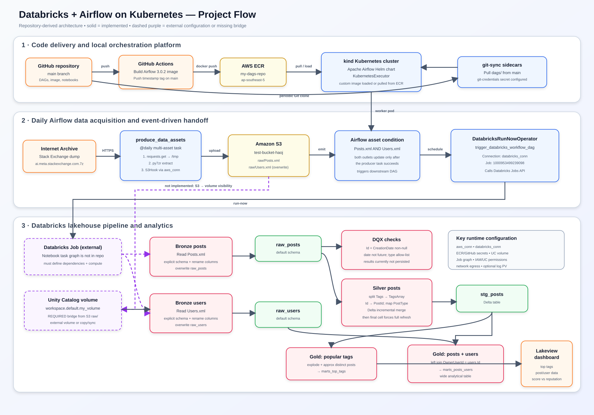

# Databricks + Airflow on Kubernetes

This project runs Apache Airflow 3.0.2 on a local [kind](https://kind.sigs.k8s.io/) Kubernetes cluster and uses it to acquire a Stack Exchange data dump, place selected XML files in Amazon S3, and trigger a Databricks Job. Databricks notebooks then build bronze/raw, silver/staging, and gold/mart tables that feed a Lakeview dashboard.

> [!IMPORTANT]
> The repository contains the Airflow DAGs and Databricks notebooks, but it does **not** contain the Databricks Job definition or an implemented bridge between the S3 objects and the Unity Catalog volume read by the notebooks. Complete the items in [Required configuration](#required-configuration) before expecting an end-to-end run.

## Architecture

[Download the PNG flowchart](docs/project-flowchart.png) · [Full-size SVG](docs/project-flowchart.svg) · [Mermaid source](docs/project-flowchart.mmd)



Solid arrows in the diagram represent behavior implemented in this repository. Dashed purple arrows require external configuration or represent a missing integration step.

## What the project does

1. A push to `main` starts GitHub Actions, which builds `cicd/Dockerfile` and pushes a timestamp-tagged custom Airflow image to Amazon ECR.
2. One of the installation scripts creates a local kind cluster and deploys the official Apache Airflow Helm chart with `KubernetesExecutor`.
3. Airflow's `git-sync` sidecars pull the `dags/` directory from this repository. The custom image also contains a copy of the DAGs and adds `py7zr` plus the Databricks provider.
4. The daily `produce_data_assets` Airflow asset task:
   - downloads `ai.meta.stackexchange.com.7z` from Internet Archive;
   - extracts it under the worker's `/tmp` directory;
   - uploads `Posts.xml` and `Users.xml` to `s3://test-bucket-haoj/raw/`; and
   - emits two Airflow asset events after both uploads succeed.
5. When both S3 asset events are available, `trigger_databricks_workflow_dag` invokes Databricks Job `1000953499239098` through the `databricks_conn` Airflow connection.
6. The Databricks notebooks are designed to transform files exposed at `/Volumes/workspace/default/my_volume/`:
   - `bronze_posts.ipynb` and `bronze_users.ipynb` parse XML with explicit schemas and overwrite `raw_posts` and `raw_users`.
   - `bronze_posts_dqx.ipynb` runs DQX checks and splits valid from quarantined rows, but does not persist either result.
   - `silver_posts.ipynb` normalizes tags, renames the post key, maps post type labels, and writes `default.stg_posts` as Delta.
   - `gold_most_popular_tags.ipynb` creates `marts_top_tags`.
   - `gold_posts_users.ipynb` creates `marts_posts_users` by joining posts to users.
   - `my-dashboard.lvdash.json` visualizes the mart tables, including top tags and average answer score versus user reputation.

The `example_dag` is an independent daily smoke-test DAG (`hello_world` → `bye_world`) and is not part of the data pipeline.

## Repository layout

```text
.
├── .github/workflows/cicd.yaml       # Build and push the Airflow image to ECR
├── chart/
│   ├── values-override.yaml          # Non-persistent Airflow Helm overrides
│   └── values-override-persistence.yaml
├── cicd/Dockerfile                   # Airflow 3.0.2 / Python 3.11 custom image
├── dags/
│   ├── produce_data_assets.py        # Download, extract, and upload S3 assets
│   ├── trigger_databricks_workflow.py
│   └── example_dag.py
├── docs/
│   ├── project-flowchart.svg         # Downloadable architecture image
│   └── project-flowchart.mmd         # Editable Mermaid diagram
├── k8s/
│   ├── clusters/kind-cluster.yaml    # kind topology and log host mount
│   └── volumes/                      # 5 GiB hostPath PV and PVC
├── notebooks/                        # Databricks notebooks and Lakeview dashboard
├── install_airflow.sh                # Local image, no persistent logs
├── install_airflow_with_persistence.sh
├── install_airflow_with_ecr.sh       # ECR image plus persistent logs
├── upgrade_airflow.sh                # Rebuild image and Helm-upgrade Airflow
└── requirements.txt
```

Runtime logs currently present in `dag_processor/` and `dag_id=example_dag/` are generated artifacts, not source code.

## Required configuration

### 1. Local tools

Install and start the following before running an installation script:

- Docker Desktop or another Docker daemon
- `kind`
- `kubectl`
- Helm 3
- AWS CLI v2 for the ECR-based path
- Bash (WSL or Git Bash on Windows, because the project scripts are `.sh` files)
- A GitHub account and Git personal access token only if the DAG repository is private
- An AWS account with an S3 bucket and, for CI/CD, an ECR repository
- A Databricks workspace with Unity Catalog and permission to create/run a Job

The scripts recreate the kind cluster named `kind`; that deletes the old cluster and all non-persisted state.

### 2. Replace or parameterize hard-coded values

| Setting | Current value | Files | What to do |
|---|---|---|---|
| AWS region | `ap-southeast-5` | CI workflow, ECR install script | Change if the ECR repository is in another region. |
| AWS account/ECR registry | `155908724326.dkr.ecr.ap-southeast-5.amazonaws.com` | `install_airflow_with_ecr.sh` | Replace with your registry. Prefer an environment variable rather than committing an account-specific value. |
| ECR repository | `my-dags-repo` | CI workflow, ECR install script | Create it or replace the name in both locations. |
| S3 bucket | `test-bucket-haoj` | `dags/produce_data_assets.py` | Create it or replace all occurrences. |
| Stack Exchange site | `ai.meta.stackexchange.com` | `dags/produce_data_assets.py` | Change the archive key if another Stack Exchange site is desired. |
| Git repository/ref | GitHub repository on `main` | both Helm override files | Point at your fork and desired branch/tag. |
| Databricks Job ID | `1000953499239098` | `dags/trigger_databricks_workflow.py` | Replace with the Job ID in your workspace. |
| UC file path | `/Volumes/workspace/default/my_volume` | bronze notebooks | Create this external volume or update the notebook paths. |
| Catalog/schema | mostly `default`; dashboard uses `workspace.default` | notebooks/dashboard | Set the Job's default catalog to `workspace`, or fully qualify all table names consistently. |
| Log host path | blank | `k8s/clusters/kind-cluster.yaml` | Set an absolute host directory before using a persistence script. |

### 3. GitHub Actions secrets

Configure these under **Repository settings → Secrets and variables → Actions**:

| Secret | Purpose |
|---|---|
| `AWS_ACCESS_KEY_ID` | IAM access key used by GitHub Actions to push to ECR. |
| `AWS_SECRET_ACCESS_KEY` | Matching IAM secret key. |
| `ECR_REGISTRY` | Registry hostname only, for example `123456789012.dkr.ecr.ap-southeast-5.amazonaws.com`. |

The CI identity needs ECR authorization, layer upload, and image push permissions for `my-dags-repo`. Prefer GitHub OIDC with an AWS IAM role instead of long-lived access keys for a production setup; the checked-in workflow currently expects keys.

### 4. AWS and Airflow connection

Create the target S3 bucket, then create an Airflow connection named exactly `aws_conn`:

| Airflow field | Value |
|---|---|
| Connection ID | `aws_conn` |
| Connection type | Amazon Web Services |
| Login / password | AWS access key ID / secret access key, unless using an IAM role |
| Extra | `{"region_name": "YOUR_S3_REGION"}` |

The runtime identity needs permission to write `s3://YOUR_BUCKET/raw/Posts.xml` and `raw/Users.xml` and any multipart-upload actions needed for large files. Store credentials in an Airflow/Kubernetes secret or use workload identity; do not commit credentials to the repository.

`produce_data_assets.py` imports `airflow.providers.amazon.aws.hooks.s3.S3Hook`, but `requirements.txt` does not currently install `apache-airflow-providers-amazon`. Add a version compatible with Airflow 3.0.2 to the image requirements before building unless your chosen base image already supplies it.

### 5. Databricks connection and token

Create an Airflow connection named exactly `databricks_conn`:

| Airflow field | Value |
|---|---|
| Connection ID | `databricks_conn` |
| Connection type | Databricks |
| Host | Workspace URL, such as `https://adb-<workspace-id>.<region>.azuredatabricks.net` or the AWS equivalent |
| Password/token | A Databricks personal access token, or configure OAuth/service-principal fields supported by the provider |

The Databricks identity needs permission to run the configured Job and to read its status. For production, prefer a service principal with OAuth and least-privilege Job permissions over a personal access token.

### 6. Make the S3 files visible at the Unity Catalog volume path

The Airflow DAG writes to S3 while the notebooks read a Unity Catalog volume. Choose one of these designs:

1. **Recommended:** create an AWS-backed Unity Catalog storage credential/external location for `s3://YOUR_BUCKET/raw/`, then create the external volume `workspace.default.my_volume` at that location.
2. Add a first Databricks Job task that copies `Posts.xml` and `Users.xml` from S3 into the existing managed volume.
3. Change the bronze notebooks to read `s3://...`/`s3a://...` directly and attach suitable AWS credentials to the Databricks compute.

The Job principal needs `USE CATALOG`, `USE SCHEMA`, `READ VOLUME`, and table create/modify permissions in the selected catalog and schema. An external volume also requires a configured Databricks storage credential and external location with access to the S3 prefix.

### 7. Create the Databricks Job

The repository does not export the Job definition. Create a Job whose task dependencies are equivalent to:

```text
bronze_posts ─┬─> bronze_posts_dqx (optional quality branch)
              └─> silver_posts ─┬─> gold_most_popular_tags
                                └─> gold_posts_users <─ bronze_users
```

Upload/import the notebooks from `notebooks/`, select compatible Databricks compute, and then replace the hard-coded Airflow Job ID. The compute must support `format("xml")`; if its runtime does not include XML data-source support, attach the compatible `spark-xml` library. The DQX notebook installs `databricks-labs-dqx` itself and restarts Python.

Decide whether DQX should gate downstream processing. As written, it only displays quarantined rows and neither saves them nor fails the pipeline.

### 8. Git sync credentials

Both Helm override files specify `credentialsSecret: git-credentials`, while the secret manifest is deliberately ignored and is not in the repository.

For a private HTTPS repository, create it after the `airflow` namespace exists:

```bash
kubectl -n airflow create secret generic git-credentials \
  --from-literal=GITSYNC_USERNAME='YOUR_GITHUB_USERNAME' \
  --from-literal=GITSYNC_PASSWORD='YOUR_GITHUB_PAT'
```

For a public repository, remove `credentialsSecret: git-credentials` from the Helm values and remove the `kubectl apply -f k8s/secrets/git-secrets.yaml` step. Never commit the token-bearing YAML file.

### 9. Persistent Airflow logs

Before using either persistence script, set `hostPath` in `k8s/clusters/kind-cluster.yaml`, for example:

```yaml
extraMounts:
  - hostPath: /absolute/path/on/the-docker-host/airflow-logs
    containerPath: /mnt/airflow-data/logs
```

The kind worker mount, `airflow-logs-pv`, `airflow-logs-pvc`, and the Helm release must all refer to the same namespace/path arrangement. The current PV uses `hostPath`, which is suitable for this single local cluster, not for a multi-node production cluster.

## Run locally

Choose one path from the repository root.

### Local image, ephemeral logs

```bash
./install_airflow.sh
```

### Local image, persistent logs

```bash
./install_airflow_with_persistence.sh
```

### Image pulled from ECR, persistent logs

```bash
aws configure
./install_airflow_with_ecr.sh
```

The scripts finish by forwarding the Airflow API/UI service to <http://localhost:8080>. That foreground `kubectl port-forward` process must remain running.

Useful checks:

```bash
kubectl get pods -n airflow
kubectl get pvc -n airflow
kubectl logs -n airflow deployment/airflow-scheduler --tail=200
kubectl port-forward -n airflow svc/airflow-api-server 8080:8080
```

In the Airflow UI, confirm that `produce_data_assets`, `trigger_databricks_workflow_dag`, and `example_dag` parse successfully. Trigger the producer manually for the first test, then verify the two S3 objects, the downstream asset-triggered run, the Databricks Job run, and the five expected tables.

## Upgrade an existing local deployment

```bash
./upgrade_airflow.sh
```

This builds a timestamp-tagged `my-dags` image, loads it into the existing kind cluster, and submits a Helm upgrade. It assumes the cluster, Helm repository, namespace, and release already exist.

## Expected data products

| Layer | Object | Produced by | Notes |
|---|---|---|---|
| Raw files | `raw/Posts.xml`, `raw/Users.xml` in S3 | Airflow asset task | Replaced on every successful daily run. |
| Bronze | `default.raw_posts` | `bronze_posts.ipynb` | Overwritten with an explicit schema. |
| Bronze | `default.raw_users` | `bronze_users.ipynb` | Overwritten with an explicit schema. |
| Silver | `default.stg_posts` | `silver_posts.ipynb` | Delta table with tags array and post type label. |
| Gold | `default.marts_top_tags` | `gold_most_popular_tags.ipynb` | Tag counts ordered descending. |
| Gold | `default.marts_posts_users` | `gold_posts_users.ipynb` | Left-joined post/user analytical table. |
| Presentation | Lakeview dashboard | `my-dashboard.lvdash.json` | References `workspace.default` explicitly in places. |

## Known limitations and review findings

- **S3/volume integration is absent.** This is the main blocker to a complete run and must be implemented as described above.
- **The Databricks Job is external.** Task order, compute, libraries, retries, and permissions cannot be reproduced from this repository alone.
- **The Amazon provider is not declared.** `S3Hook` may fail to import in a clean image until `apache-airflow-providers-amazon` is added.
- **The silver notebook ends with a forced full refresh.** It first performs an incremental merge, then its last executable cell calls the same function with `full_refresh=True`, overwriting the table. Remove or parameterize that final cell if incremental behavior is intended.
- **DQX results are transient.** `valid_df` and `quarantined_df` are only displayed. Persist quarantine/metrics and define a failure threshold if quality checks should protect downstream tables.
- **Review the DQX allowed-value types.** `PostTypeId` is loaded as a numeric type, while the allow-list is written as strings (`"1"`–`"4"`). Align the types and decide whether post types beyond 4 should be warnings.
- **A historical parser timeout exists in checked-in logs.** On 2026-10-04, importing `trigger_databricks_workflow.py` exceeded 30 seconds while loading `py7zr`/crypto dependencies. Later logs show successful parsing. Moving heavy imports (`py7zr`, and optionally `requests`) inside the task body reduces DAG parse overhead.
- **Downloads are memory-heavy and unbounded.** `requests.get()` has no timeout and buffers the complete archive before writing. Stream the response, set connect/read timeouts, retry transient failures, and clean `/tmp` after upload.
- **Values mix image-baked DAGs and git-synced DAGs.** This works, but git-sync is the effective source at runtime and can differ from the image. Choose one deployment model if strict reproducibility matters.
- **The generated `chart/values-example.yaml` is a snapshot.** Re-running `helm show values` can change it when the chart repository advances. Pin an Airflow Helm chart version in scripts for reproducible deployments.
- **Local persistence is not production storage.** The `hostPath` PV has single-host semantics even though it declares `ReadWriteMany`.
- **Secrets and generated logs need care.** Keep `k8s/secrets/git-secrets.yaml` ignored, and consider ignoring/removing runtime log directories from source control.

## Security notes

- Do not place AWS keys, Databricks tokens, GitHub PATs, Airflow Fernet keys, or API/JWT secret keys in Helm values committed to Git.
- Use Kubernetes Secrets or an external secrets manager and rotate any credential that has previously been committed.
- Scope the Airflow AWS identity to the required S3 prefix and the CI identity to the required ECR repository.
- Scope the Databricks identity to `Can Run` on the target Job and only the necessary Unity Catalog objects.
- For any deployment beyond local development, use an external metadata database, production-grade persistent storage, TLS/Ingress, pinned images/chart versions, and static Airflow API/JWT/Fernet secrets.

## Validation checklist

- [ ] `docker`, `kind`, `kubectl`, `helm`, and (for ECR) `aws` are available.
- [ ] ECR repository and S3 bucket exist in the configured account/region.
- [ ] GitHub Actions secrets are configured and the image push succeeds.
- [ ] `aws_conn` and `databricks_conn` exist in Airflow.
- [ ] Git sync can clone the repository, with a secret only if required.
- [ ] The kind log `hostPath` is set when persistence is enabled.
- [ ] S3 `raw/` is exposed or copied to `workspace.default.my_volume`.
- [ ] The Databricks Job and notebook task dependencies exist, and its ID matches the DAG.
- [ ] Databricks compute can read XML and create/modify the target Delta tables.
- [ ] Airflow DAGs parse; the producer creates two S3 objects; the Databricks run succeeds.
- [ ] `raw_posts`, `raw_users`, `stg_posts`, `marts_top_tags`, and `marts_posts_users` are populated.
- [ ] The Lakeview dashboard datasets resolve in the same catalog/schema.
